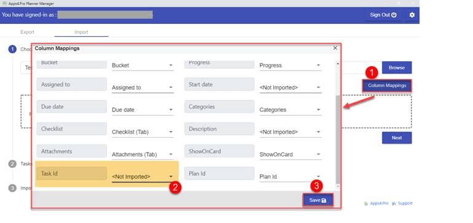

To avoid this error, please set the TaskId field as NotImported in Column Mappings as shown below image. 

 

**Note:** When you import tasks into existing Plan, if the Excel includes the field Task Id, then the extension look for the Planner task for the specified task id and update the task with current details that found in Excel file. 
