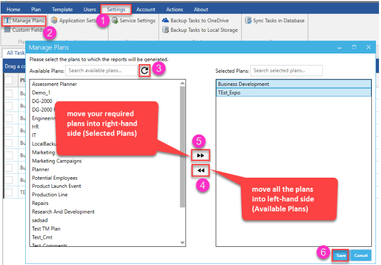

 a. Go to Settings -> Manage Plans ->  Refresh -> move the Selected Plans to Available plans  

 b. Now again move the required plans for which you need  to generate reports from the app to Selected Plans and click Save. 
 

