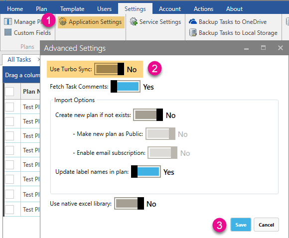

Go to Settings >> Application Settings >> turn off Use Turbo sync >> Save and generate All Tasks report. 

If you still face the issue please send us the log file from the below path for further analysis. 

 “C:\Users\<UserName>\AppData\Local\Temp\JiJiTechnologies\PlannerManager.log” 

 
