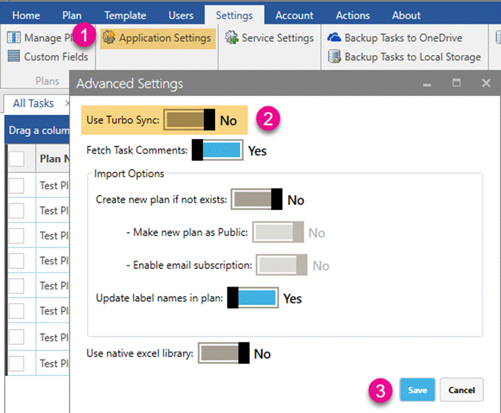

-    Close Planner Manager app (if already opened). 

-    Uninstall existing setup from Windows Control Panel. 

-    Remove the installation folder in below path. 

-   "C:\Users\<UserName>\AppData\Local\JiJiTechnologies\Apps4.Pro\Planner Manager" 

-    Download and install latest setup from below link: 

      https://apps4.pro/planner-manager-download.aspx 

-    Once you completed the installation, Go to **Settings** >> **Application Settings** >> turn off **Use Turbo sync** >> **Save.**

