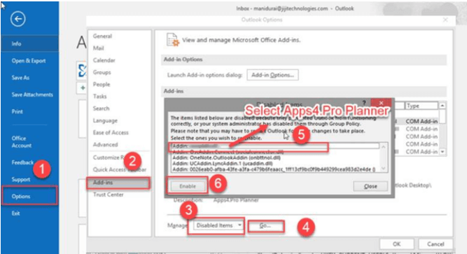

Follow the below steps to solve this problem 

a. Please click **File** menu in outlook and follow the numerical points as shown in the below screenshot to enable Apps4pro add-in 

 

b. Once you completed the above steps or if you don’t find Apps4pro in disabled add-ins list , click **File** menu again and follow the numerical points as shown in the below screenshot. 

Even after performing the above steps,  

If the add-in is still not available, uncheck “Apps4.Pro Planner” under the COM Add-ins window and click OK. Once again click File menu >> Options >> Add-ins >> check “Apps4.Pro Planner” under the COM Add-ins window and click OK and try again. 
 
 

 
