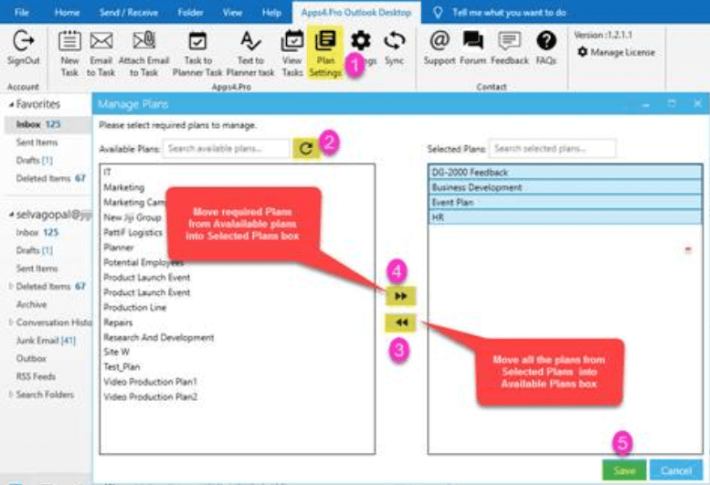

Go to Plan Settings >> click refresh icon >> Move all the plans from “Selected Plans” box into “Available Plans” box >> Move required plans from “Available Plans” box into “Selected Plans” box >> Save and then click on the sync icon. 

