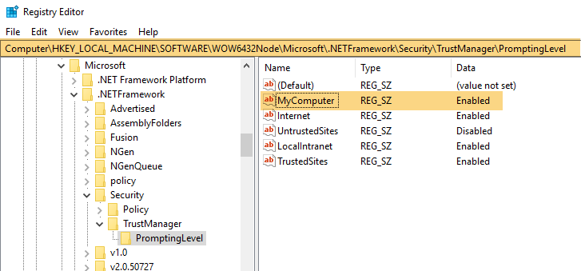

Change the following registry value and check.  

 \HKEY_LOCAL_MACHINE\SOFTWARE\MICROSOFT\.NETFramework\Security\TrustManager\PromptingLevel\MyComputer from "Disabled" to "Enabled",  

 And  

HKEY_LOCAL_MACHINE\SOFTWARE\Wow6432Node\MICROSOFT\.NETFramework\Security\TrustManager\PromptingLevel\MyComputer from "Disabled" to "Enabled", 

**Note:**If the registry key does not exist, you can create it. Add the following subkeys as String Value, with the associated values shown in the following table and try again. 
 
| **String Value subkey**   | **Value** |
| -----------------------   | --------- |
| Internet                  | Enabled   | 
| UntrustedSites            | Disabled  |
| MyComputer                | Enabled   |
| LocalIntranet             | Enabled   |
|TrustedSites               | Enabled   |

  
